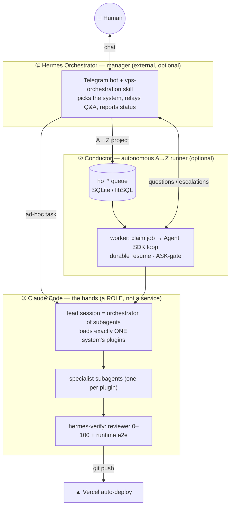

# 3dlook-marketing · `sergiy_config`

Ports **Sergiy's two-layer agent architecture** onto Vadim's 3DLOOK repo,
**without touching Vadim's original system** (kept pristine in `marketing_vb/`).
Shape: **Hermes = the orchestrator (brain) · Conductor = the A→Z runner · Claude
Code = the hands.**

## Architecture — how the pieces fit



**They complement, not duplicate:** Hermes is the always-on brain that talks to
you and *decides what runs*; the Conductor *runs it unattended* (queue, resume,
escalation); Claude Code *does the work* by delegating to specialist subagents
and self-verifying. You **build only ① and ②** — ③ appears automatically because
plugins/subagents live *inside* a Claude Code session and are reachable only from
within it (the Task tool); Hermes and the Conductor can't call them directly,
they can only **start `claude`**, and that session *is* layer ③.

Each is optional downward: no Hermes → you route by hand; no Conductor → you run
Claude Code interactively; but ③ is never skippable — it *is* Claude Code.

---

## Layer ① — Hermes Orchestrator  ·  `hermes_agent/`
External manager (Telegram bot, cheap model). Product intake, routing, relay,
reports — **no technical decisions**. Keep Vadim's `marketing_vb/telegram-bot/`,
run Sergiy-style Hermes, or skip it.
| Piece | What |
|---|---|
| `skills/vps-orchestration` | the operating policy (route to Claude Code, ask-by-default, drive the Conductor, escalate) |
| `ops/orchestrator-run.sh` · `orchestrator-monitor.sh` | start the worker · push new questions/escalations/done to Telegram |
| `ops/model-router` · `skill-guard` · `vault-sync` · `systemd/` | provider tiering · gated skill install · Obsidian memory sync · service units |

## Layer ② — Conductor  ·  `claude_code/DEV/full_stack_sm/conductor/`
TS service over the Claude **Agent SDK**. Pulls a job, runs the per-step loop
(executor → reviewer → runtime → git), **durable resume**, escalates ASK-actions
(merge / destructive SQL / db push / terraform) to Telegram. **No cost cap** by
design — only a loop-detecting circuit breaker.
**State = SQLite/libSQL** (`@libsql/client`; default `file:./ho.db`, or Turso by
changing `DATABASE_URL` — **no Postgres**): tables `ho_jobs` `ho_runs` `ho_steps`
`ho_questions` `ho_escalations` + views `ho_project_status` `ho_job_progress`.
Claim/next-step/recover run as single-writer write-transactions in `store.ts`.

## Layer ③ — Claude Code: the 6 systems (profiles)
One active at a time (mutual exclusion) — `switch-profile.sh <system>`, restart
Claude Code. Marketplace paths are relative → portable.

| System | For | Enables (plugins) | Entry |
|---|---|---|---|
| **`marketing_vb_sm`** | **Vadim's default** — the mix | base + `mvb-*` + `mkt-*` + `mvb-sm-bridge` | `/vbsm-campaign` |
| **`marketing_vb`** | Vadim's original (pure) | `mvb-core/social/seo/outbound` | `/new-article` `/weekly-posts` `/outbound` `/qc` … |
| **`marketing`** | Sergiy generic marketing | base + `mkt-*` | `/mkt-campaign` |
| **`dev`** | full-stack development | `hermes-*` (11) | `/sm-feature` `/sm-verify` `/sm-docs` |
| **`seo`** | search optimization | base + `seo-*` | `/seo-audit` |
| **`security`** | audit / hardening | base + `sec-core` (+ `security-auditor`) | agents · `/sm-verify` |

"base" = `hermes-core` (planning/handoff) + `hermes-verify` (quality gates). The
**mix** rule: Sergiy decides *what & why* (strategy, spend, measurement); Vadim
decides *on-brand & true* (voice, claims, QC) — see the `marketing-vb-sm` skill.

---

## Plugins → agents (one line each)

**`full_stack_sm` (dev base)**
| Plugin | Agents · role |
|---|---|
| `hermes-core` | **product-architect** (Opus) — spec/architecture/plan/NFR/risk |
| `hermes-design` | **design-director** — UI/UX direction, design system, motion |
| `hermes-frontend` | **frontend-engineer** — TS/React/Next + visual self-check |
| `hermes-backend` | **backend-engineer** — APIs, business logic, integrations, jobs |
| `hermes-data` | **database-engineer** — schema, migrations, RLS, query opt |
| `hermes-platform` | **platform-engineer** — hosting, cloud/IaC, CI/CD |
| `hermes-quality` | **qa-engineer** (tests/Playwright) · **security-auditor** (Opus, audit gate) |
| `hermes-sre` | **sre-engineer** — errors, observability, caching, availability |
| `hermes-scout` | **trend-scout** (daily scan, report-only) · **solution-evaluator** (`/sm-evaluate`) |
| `hermes-verify` | **code-reviewer** (0–100+evidence) · **runtime-verifier** (boots front+back+db, e2e) |
| `hermes-ecc` | advisory read-only reviewers: database / performance / react / typescript / refactor / silent-failure / type-design |

**`seo_sm`** — `seo-strategist` (lead, `/seo-audit`) · `technical-seo-engineer` · `content-strategist` · `link-authority-strategist` · `seo-analyst`
**`marketing_sm`** — `marketing-strategist` (lead, `/mkt-campaign`) · `content-marketer` · `paid-media-buyer` · `lifecycle-marketer` · `marketing-analyst`
**`security_sm`** — `sec-core`: `silent-failure-hunter` + `security-bounty-hunter` skill (pairs with `security-auditor`)

**`marketing_vb` (Vadim, packaged)**
| Plugin | Agents · role |
|---|---|
| `mvb-core` | **orchestrator** (single entry) · brand-checker · quality-controller · context-pack-builder · agent-improver + all `/`-commands |
| `mvb-social` | post-drafter · quarterly-strategist · social-analytics · visual-brief |
| `mvb-seo` | seo-planner → seo-writer → seo-editor → seo-publisher |
| `mvb-outbound` | hypothesis-generator · icp-validator · company-researcher · people-extractor · message-sequencer · closelyhq-importer · campaign-analyzer · response-classifier |
| `mvb-sm-bridge` | the mix: `/vbsm-campaign` + `marketing-vb-sm` skill (Sergiy strategy → Vadim execution → dual QC → measurement) |

## Skills (one line each)
| Skill | Plugin | What |
|---|---|---|
| `project-planning` | hermes-core | idea → deep interview → structured executable plan |
| `scratchpad-protocol` | hermes-core | file-based handoff between isolated subagents |
| `session-handoff` | hermes-core | survive `/clear` / compaction across sessions |
| `verification-protocol` | hermes-verify | gates re-run + reviewer + runtime, retry-until-pass |
| `ultracite-lint` | hermes-verify | the standard lint/format gate (Biome preset) |
| `trend-scan` | hermes-scout | ecosystem scan method + scoring + security gate |
| `codebase-onboarding` · `context-budget` | hermes-ecc | onboard a repo · audit context-window bloat |
| `seo-methodology` · `technical-seo-audit` · `keyword-research` · `article-writing` · `seo-reporting` | seo_sm | the SEO playbooks |
| `marketing-strategy` · `market-research` · `content-engine` · `brand-voice` · `content-calendar` · `crosspost` · `paid-media` · `marketing-measurement` | marketing_sm | the marketing playbooks |
| `marketing-vb-sm` | mvb-sm-bridge | the blended Vadim×Sergiy workflow + precedence rules |

---

## Get started
```bash
./install.sh                     # checks, prepares Conductor (libSQL), renders systemd
claude_code/DEV/switch-profile.sh marketing_vb_sm   # then restart Claude Code
```
Full setup → [INSTALL.md](INSTALL.md) · systems guide → [claude_code/DEV/SYSTEMS.md](claude_code/DEV/SYSTEMS.md) · Conductor internals → [conductor/ARCHITECTURE.md](claude_code/DEV/full_stack_sm/conductor/ARCHITECTURE.md).

> ### ⚠️ Run the marketing profiles **from inside `marketing_vb/`**
> The `mvb-*` agents read brand context by **relative path** (`about-me.md`,
> `audience.md`, `DESIGN.md`, `CLAUDE.md`, `brand-assets/`, `workspace/`) — the
> same way Vadim's original system did. Those files live in
> [`marketing_vb/`](marketing_vb), so start Claude Code there:
> ```bash
> cd marketing_vb && claude
> ```
> Launching from the repo root instead will make the agents look for
> `about-me.md` / `brand-assets/` at the top level and **not find them**. The
> profile (plugins) is global; only the working directory decides whether the
> brand context is visible.

> Vadim's original system stays untouched under [`marketing_vb/`](marketing_vb);
> the `mvb-*` plugins are packaged copies of its `.claude/` — re-sync if the
> originals change.
