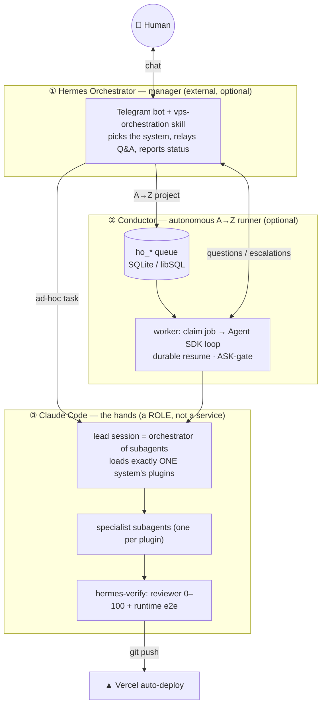

<div align="center">


# AI Agents Config

**Autonomous full-stack development on Claude Code — Hermes = the orchestrator (brain), Conductor = the A→Z runner, Claude Code = the hands.**

</div>

## Repository layout

Everything for the Telegram-bot AI agent lives under **one** tree, so the whole
system can be redeployed on any VPS:

> **AI Agents › Telegram Bot Agent › { Hermes Agent · Claude Code Agent }**

```
agents-ai/                          # AI Agents
└── telegram-bot-agent/             # Telegram Bot Agent  (@ivan_djedaev_bot)
    ├── hermes-agent/               # Hermes Agent — the orchestrator: bot logic, message
    │                               #   forwarding + topic-picker, claude-switcher, ops,
    │                               #   SOUL persona, config templates, memory vault
    └── claude-code-agent/          # Claude Code Agent — MCP servers, skills, and the
                                    #   Dev / SEO / Marketing / Security (+ test) systems
                                    #   as plugins (the marketplaces the bot's Claude runs)
n8n/                                # separate n8n MCP integration (not part of the bot)
archive/                            # retired experiments (git history preserved)
```

Folder names are **kebab-case** (safe for the many shell scripts, systemd units
and cron paths); the spaced labels above are the human-readable display names.

## Architecture — how the pieces fit



**They complement, not duplicate:** Hermes is the always-on brain that talks to
you and *decides what runs*; the Conductor *runs it unattended* (queue, resume,
escalation); Claude Code *does the work* by delegating to specialist subagents
and self-verifying. You **build only ① and ②** — ③ appears automatically because
plugins/subagents live *inside* a Claude Code session and are reachable only from
within it (the Task tool); Hermes and the Conductor can't call them directly,
they can only **start `claude`**, and that session *is* layer ③. Each is optional
downward (no Hermes → route by hand; no Conductor → run Claude Code interactively);
③ is never skippable — it *is* Claude Code.

---

## Установка одной командой

Вся система (Hermes Agent + Telegram-бот + Claude Code/OpenCode) ставится из
одного zip-кита. Собрать кит на машине-источнике:

```bash
bash make-release.sh          # → dist/ai-agent-bot-<sha>.zip   (внутри НЕТ секретов)
```

На целевом сервере — одна команда на всё:

```bash
unzip -q ai-agent-bot-*.zip && cd ai-agent-bot && ./install.sh
```

`install.sh` спросит каждый секрет в диалоге, поставит пакеты, upstream
hermes-agent, перепишет пути под этого пользователя, запишет и закроет (0600)
конфиги, поднимет Qdrant + OpenCode + systemd + cron, зарегистрирует
Telegram-сессию и проверит `telegram: connected`. Что требует живого человека
(OAuth провайдера, SMS-код) — спросит или выведет списком в конце.

Для агента, без диалога:

```bash
cp secrets.env.example secrets.env && nano secrets.env      # заполнить по таблице ниже
./install.sh --secrets secrets.env --yes
```

Повторный запуск безопасен: существующие `.env` / `config.yaml` / `ai-models.env`
не перезаписываются, обновляются только заданные значения.

### Кому принадлежит система (важно при переносе)

В ките есть файлы, которые агент читает **как инструкции**: `SOUL.md` («менеджер
владельца», «наружу от лица владельца — ничего») и скилл `vps-orchestration`
(«мёрж — решение владельца», «новый репо → `gh repo create <аккаунт>/<name>`»).
Поэтому имя владельца, GitHub-аккаунт и корень проектов — не константы, а токены,
которые установщик подставляет:

| Токен | Флаг | По умолчанию |
|---|---|---|
| `@OWNER@` | `--owner "Имя"` | `gh api user` → `.name`, иначе `$USER` |
| `@GH_OWNER@` | `--gh-owner login` | `gh api user` → `.login`, иначе `$USER` |
| `@PROJECT_ROOT@` | `--project-root DIR` | папка кита, если рядом лежит контент; иначе `~/workspaces` |

Значения пишутся в `~/.hermes/.env` (`HERMES_OWNER`, `HERMES_GH_OWNER`,
`HERMES_PROJECT_ROOT`) — оттуда их берёт `hermes-update.py`, который каждое утро
восстанавливает `SOUL.md` из репозитория и рендерит те же токены. Без этого
персона на следующий день начала бы обращаться к литеральному `@OWNER@`.

**Корень проектов ≠ `--dest`.** Система ставится в `/srv/<user>/ai-agents-config`,
а контент остаётся там, где его держит человек. От `@PROJECT_ROOT@` зависят
`runFrom` профилей, корень поиска для `/cwd <имя>` и дефолтная папка задач
дирижёра.

**Профиль, привязанный к папке.** Профиль может объявить `runFrom` — систему, чьи
агенты читают контекст **относительными** путями, и она работает только если
сессия стартовала именно там. `switch-profile.sh` проверяет папку, пишет её в
`~/.claude/.active-profile-cwd` и печатает `cd … && claude`; Telegram-switcher
берёт её как дефолт для вкладки без явного `/cwd`. Папки нет — громкое
предупреждение, а не тихий откат в общий корень.

## Что нужно от тебя, чтобы всё заработало

Всё это заполняется в **одном** файле — `secrets.env` (шаблон:
[`secrets.env.example`](./secrets.env.example)). Больше руками ничего искать не
нужно.

**[REQ]** — без него `install.sh` остановится · **[РЕК]** — без него часть
системы не работает · **[ОПЦ]** — можно добавить позже.

| Что | Переменная | Где взять | Что сломано без него |
|---|---|---|---|
| **[REQ]** Токен твоего бота | `TELEGRAM_BOT_TOKEN` | [@BotFather](https://t.me/BotFather) → `/newbot` (или `/mybots` → API Token). Вид `8123456789:AAF…` — id бота и секрет в одной строке | нет бота — нет системы |
| **[REQ]** Твой Telegram user id | `TELEGRAM_ALLOWED_USERS` | [@userinfobot](https://t.me/userinfobot) → `Id`. Число. Несколько — через запятую | бот не ответит никому; это и есть whitelist |
| **[REQ]** Мозг менеджера | `OPENCODE_ZEN_API_KEY` | opencode.ai → Dashboard → API keys. Роутинг идёт через llm-failover-proxy, провайдер `opencode` = zen-эндпоинт | Hermes не думает |
| *(legacy)* | `OPENCODE_GO_API_KEY` | GO убран из стека; заполнять не нужно — принимается только чтобы старый `secrets.env` не ломал установку | — |
| **[РЕК]** NVIDIA NIM | `NVIDIA_API_KEY` | [build.nvidia.com](https://build.nvidia.com) (нужна верификация по телефону) | минус самый широкий бесплатный каталог |
| **[РЕК]** ModelScope | `MODELSCOPE_API_KEY` | [modelscope.cn/my/myaccesstoken](https://modelscope.cn/my/myaccesstoken) — **потом обязательно** привязать аккаунт Alibaba Cloud (`modelscope.ai/my/settings/account`), иначе 401 при валидном токене | минус 2-й по величине каталог |
| **[РЕК]** Cloudflare Workers AI | `CLOUDFLARE_API_KEY` (+ `CLOUDFLARE_ACCOUNT_ID`, необязателен) | [dash.cloudflare.com/profile/api-tokens](https://dash.cloudflare.com/profile/api-tokens). Токен `cfat_…` не проходит `/user/tokens/verify` — это норма | минус 3-й каталог |
| **[РЕК]** OpenRouter | `OPENROUTER_API_KEY` | [openrouter.ai/keys](https://openrouter.ai/keys) | вне ротации с 08.08.2026, но полезен фолбэком |
| **[РЕК]** Gemini / Google AI Studio | `GEMINI_API_KEY` | [aistudio.google.com/app/apikey](https://aistudio.google.com/app/apikey) | **долговременная память (mem0) мертва** + нет фолбэка |
| **[РЕК]** Groq | `GROQ_API_KEY` | [console.groq.com/keys](https://console.groq.com/keys) | голосовые сообщения не расшифровываются |
| **[ОПЦ]** MTProto-приложение | `TG_API_ID` · `TG_API_HASH` · `TG_PHONE` · `TG_PASSWORD` | [my.telegram.org](https://my.telegram.org) → API development tools. Пароль — только если стоит 2FA | пропадает пикер «в какой топик положить форвард» |
| **[ОПЦ]** GitHub PAT | `GITHUB_PERSONAL_ACCESS_TOKEN` | [github.com/settings/tokens](https://github.com/settings/tokens) | нет github MCP и git-операций от агента |
| **[ОПЦ]** Postgres · Magic | `POSTGRES_CONNECTION_STRING` · `MAGIC_API_KEY` | своя база · [21st.dev](https://21st.dev) | соответствующие MCP выключены |
| — генерируется само | `MTPROTO_SESSION_KEY` · `CONDUCTOR_BRIDGE_TOKEN` | оставить **пустыми** | — |

Не ключи, но без них система неполная — `install.sh` напомнит списком в конце:

1. **Claude Code** — `sudo npm i -g @anthropic-ai/claude-code`, затем `claude` → `/login`
   (подписка Max/Pro; `ANTHROPIC_API_KEY` **не нужен** — дирижёр ходит подпиской).
2. **`hermes auth`** — OAuth провайдера Hermes, если он его требует.
3. **Активный профиль** — `claude-code-agent/DEV/switch-profile.sh dev`, затем перезапуск Claude Code.
4. **codebase-memory** — бинарь графа кода (команду печатает установщик).

### Проверка, что встало

```bash
systemctl --user is-active hermes-gateway hermes-qdrant     # active active
python3 -c "import json,os;print(json.load(open(os.path.expanduser('~/.hermes/gateway_state.json')))['platforms']['telegram']['state'])"   # connected
python3 ~/.hermes/model-router/refresh.py --dry-run          # выбор моделей на день
cd /srv/$USER/ai-agents-config && opencode run 'Reply with exactly: BACKUP-OK'   # запасной кодер (ТОЛЬКО внутри git-репо)
```

Затем напиши боту в личку — он покажет нижнюю панель с двумя ролями
(🧑‍💼 Менеджер · ⚙️ Исполнитель). Полный разбор — [`REPRODUCE.md`](./REPRODUCE.md).

---

## Layer ① — Hermes Orchestrator  ·  [`agents-ai/telegram-bot-agent/hermes-agent/`](./agents-ai/telegram-bot-agent/hermes-agent/)
External manager (Telegram bot, cheap model). Product intake, routing, relay,
reports — **no technical decisions**.
| Piece | What |
|---|---|
| `skills/vps-orchestration` | operating policy (route to Claude Code, ask-by-default, drive the Conductor, escalate) |
| `ops/orchestrator-run.sh` · `orchestrator-monitor.sh` | start the worker · push new questions/escalations/done to Telegram |
| `ops/model-router` · `skill-guard` · `vault-sync` · `systemd/` | provider tiering · gated skill install · Obsidian memory sync · service units |

## Layer ② — Conductor  ·  [`conductor/`](./agents-ai/telegram-bot-agent/claude-code-agent/DEV/dev/conductor/)
TS service over the Claude **Agent SDK**. Pulls a job, runs the per-step loop
(executor → reviewer → runtime → git), **durable resume**, escalates ASK-actions
(merge / destructive SQL / db push / terraform) to Telegram. **No cost cap** — only
a loop-detecting circuit breaker.
**State = SQLite/libSQL** (`@libsql/client`; default `file:./ho.db`, or Turso via
`DATABASE_URL` — **no Postgres**): tables `ho_jobs` `ho_runs` `ho_steps`
`ho_questions` `ho_escalations` + views `ho_project_status` `ho_job_progress`;
claim/next-step/recover are single-writer write-transactions in `store.ts`.

## Layer ③ — Claude Code: the 4 systems (profiles)
One active at a time — `agents-ai/telegram-bot-agent/claude-code-agent/DEV/switch-profile.sh <system>`, restart Claude
Code. Marketplace paths are relative → portable. Guide: [`SYSTEMS.md`](./agents-ai/telegram-bot-agent/claude-code-agent/DEV/SYSTEMS.md).

| System | For | Enables | Entry |
|---|---|---|---|
| **`dev`** (default) | full-stack development | `hermes-*` (11) | `/sm-feature` `/sm-verify` `/sm-docs` |
| **`seo`** | search optimization | base + `seo-*` | `/seo-audit` |
| **`marketing`** | digital marketing | base + `mkt-*` | `/mkt-campaign` |
| **`security`** | audit / hardening | base + `sec-core` (+ `security-auditor`) | agents · `/sm-verify` |

"base" = `hermes-core` (planning/handoff) + `hermes-verify` (quality gates).

---

## Plugins → agents (one line each)

**`dev` (dev base)**
| Plugin | Agents · role |
|---|---|
| `hermes-core` | **product-architect** (Opus) — spec/architecture/plan/NFR/risk |
| `hermes-design` | **design-director** — UI/UX direction, design system, motion |
| `hermes-frontend` | **frontend-engineer** — TS/React/Next + visual self-check |
| `hermes-backend` | **backend-engineer** — APIs, business logic, integrations, jobs |
| `hermes-data` | **database-engineer** — schema, migrations, RLS, query opt |
| `hermes-platform` | **platform-engineer** — hosting, cloud/IaC, CI/CD |
| `hermes-quality` | **qa-engineer** (tests/Playwright) · **security-auditor** (Opus, audit gate) |
| `hermes-sre` | **sre-engineer** — errors, observability, caching, availability |
| `hermes-scout` | **solution-evaluator** (`/sm-evaluate`) |
| `hermes-verify` | **code-reviewer** (0–100+evidence) · **runtime-verifier** (boots front+back+db, e2e) |
| `hermes-ecc` | advisory read-only reviewers: database / performance / react / typescript / refactor / silent-failure / type-design |

**`seo`** — `seo-strategist` (lead, `/seo-audit`) · `technical-seo-engineer` · `content-strategist` · `link-authority-strategist` · `seo-analyst`
**`marketing`** — `marketing-strategist` (lead, `/mkt-campaign`) · `content-marketer` · `paid-media-buyer` · `lifecycle-marketer` · `marketing-analyst`
**`security`** — `sec-core`: `silent-failure-hunter` + `security-bounty-hunter` skill (pairs with `security-auditor`)
**`sandbox`** — `sbx-probe`: no agents by design. Trial bench for ONE candidate plugin/skill/MCP (`/sbx-check` proves what loaded, then runs the adopt/drop checklist). Not routable — manual switch only.

## Skills (one line each)
| Skill | Plugin | What |
|---|---|---|
| `project-planning` | hermes-core | idea → deep interview → structured executable plan |
| `scratchpad-protocol` | hermes-core | file-based handoff between isolated subagents |
| `session-handoff` | hermes-core | survive `/clear` / compaction across sessions |
| `verification-protocol` | hermes-verify | gates re-run + reviewer + runtime, retry-until-pass |
| `ultracite-lint` | hermes-verify | the standard lint/format gate (Biome preset) |
| `codebase-onboarding` · `context-budget` | hermes-ecc | onboard a repo · audit context-window bloat |
| `seo-methodology` · `technical-seo-audit` · `keyword-research` · `article-writing` · `seo-reporting` | seo | the SEO playbooks |
| `marketing-strategy` · `market-research` · `content-engine` · `brand-voice` · `content-calendar` · `crosspost` · `paid-media` · `marketing-measurement` | marketing | the marketing playbooks |

---

## n8n MCP integration  ·  [`n8n/`](./n8n/)
Connects Claude Code to self-hosted n8n over MCP (17 tools: search/validate/create/
run/publish workflows + executions) so Hermes can trigger jobs by webhook/cron.
Safety hooks: `bash_guard.py`, `n8n_guard.py`, `n8n_audit.py`.

## Get started

Полная система — [«Установка одной командой»](#установка-одной-командой) выше
(`./install.sh` делает всё). Ниже — только слой ② отдельно, если нужен один
дирижёр без бота:

```bash
cd agents-ai/telegram-bot-agent/claude-code-agent/DEV/dev/conductor
cp .env.example .env && sqlite3 ho.db < sql/schema.sql   # DATABASE_URL defaults to file:./ho.db
npm install && npm test                                  # breaker + steploop + steprunner + store
npm start
# Claude Code side: agents-ai/telegram-bot-agent/claude-code-agent/DEV/switch-profile.sh dev   (then restart Claude Code)
```

> **Archive:** the retired SDK `agency-orchestrator`, the 170+ static agent
> catalog, and the earlier OrchestrAgent pipeline live under [`archive/`](./archive/)
> (git history preserved) — no longer wired into anything.

<div align="center"><sub>Powered by Claude Code + Claude Agent SDK + libSQL + n8n MCP</sub></div>
